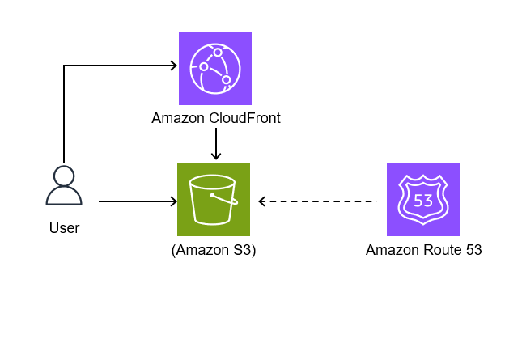
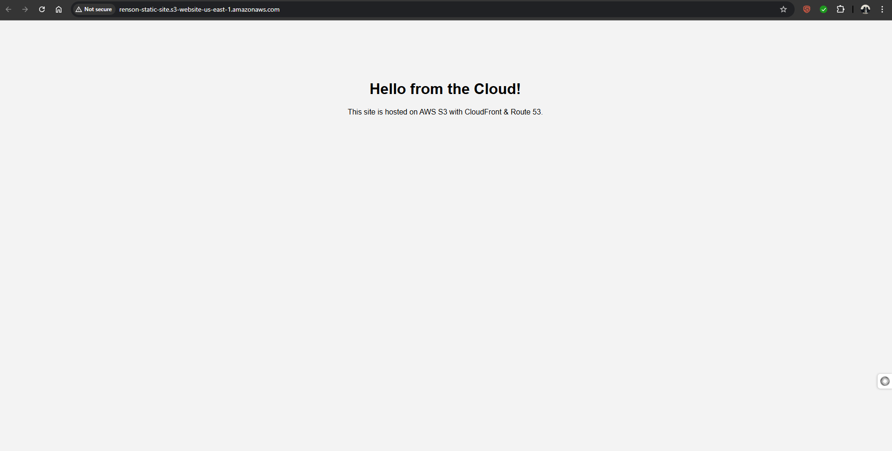
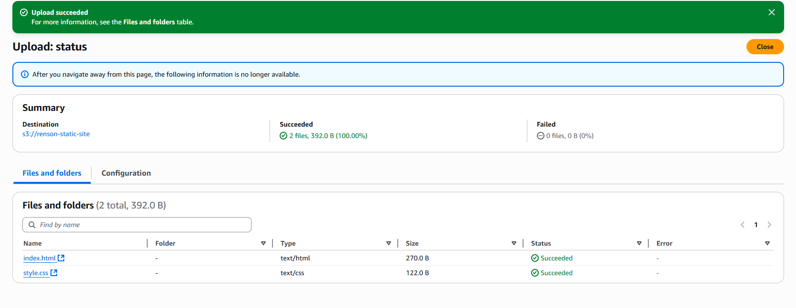
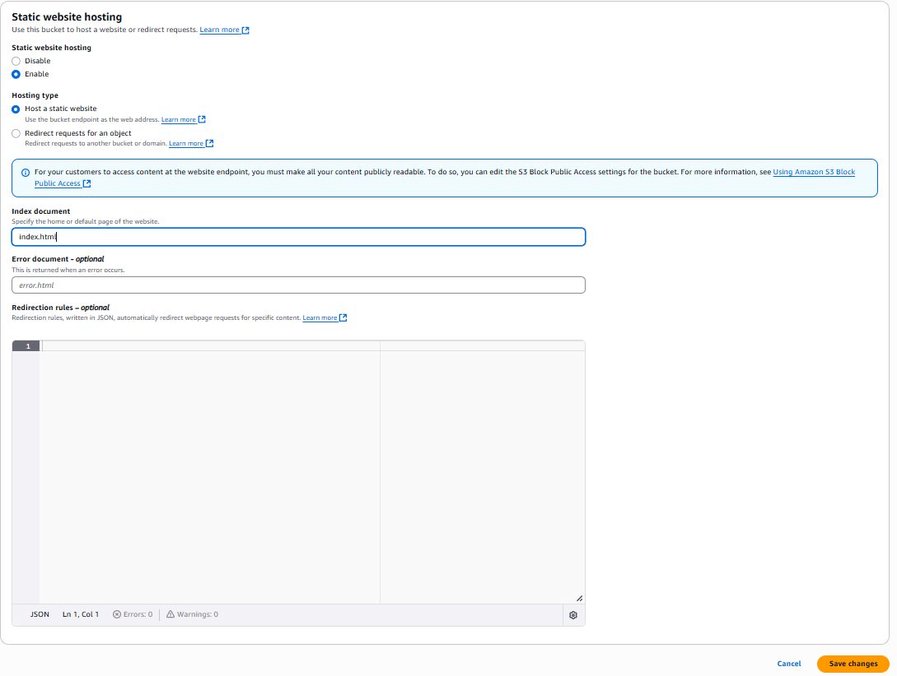
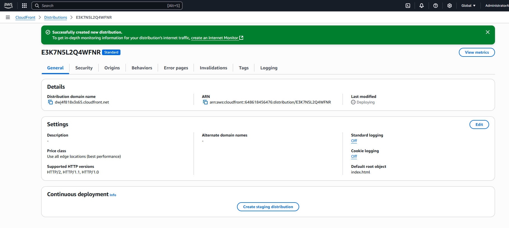
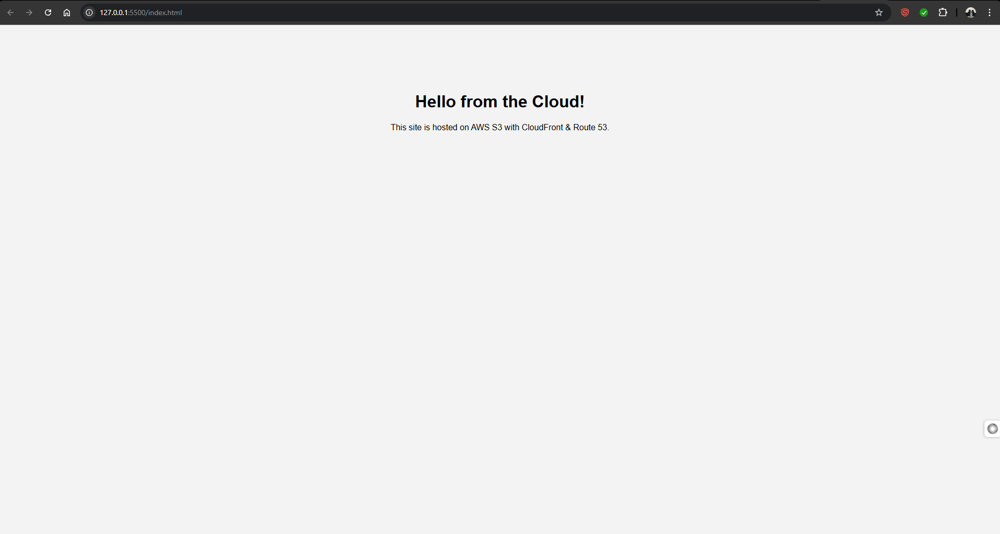

# 🌐 AWS Static Website Hosting Project

This project demonstrates how to deploy a static website using **Amazon S3**, with optional setup of **CloudFront** for HTTPS and **Route 53** for custom domain management.

---

## 🚀 Live Demo

[👉 View Website](http://your-bucket-name.s3-website-us-east-1.amazonaws.com)

---

## 🧰 Technologies Used

- HTML, CSS
- AWS S3 (Static Website Hosting)
- AWS CloudFront (CDN with HTTPS)
- AWS Route 53 (Custom domain DNS - optional)
- Git & GitHub

---

## 🖼️ Architecture Diagram

> Diagram showing the flow: Browser → CloudFront → S3 Bucket

---

## 📸 Screenshots

| Step | Screenshot |
|------|------------|
| Website preview |  |
| S3 bucket settings |  |
| S3 static website settings |  |
| CloudFront setup |  |
| Local HTML Index  |  |

---

## 📁 Folder Structure

